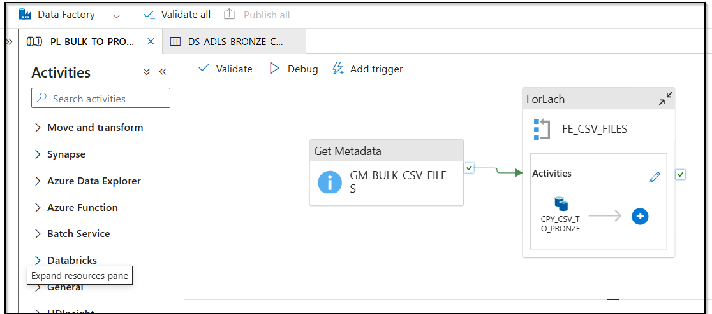
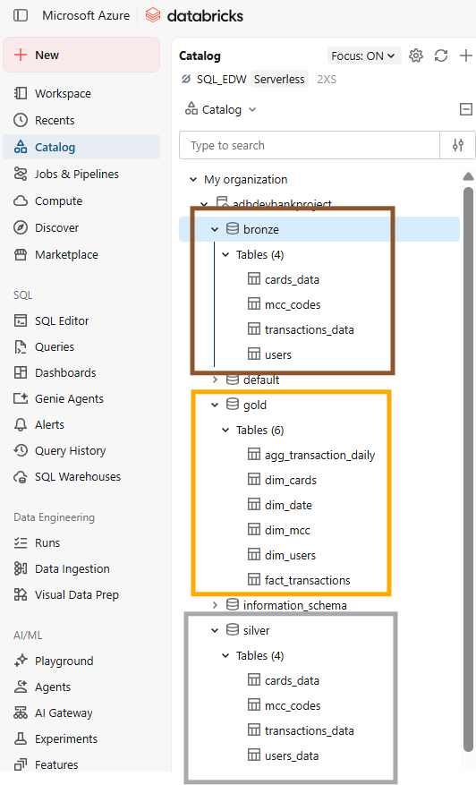
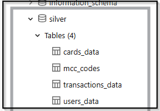
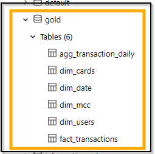

# 🏦 End-to-End Banking Data Engineering & Analytics


## 📌 Project Overview

This project demonstrates the design and implementation of an end-to-end data engineering and analytics solution for banking transaction data.

The solution follows a modern **Lakehouse Architecture**, transforming raw banking data into clean, structured, and analytics-ready datasets. The pipeline covers the complete data lifecycle, from data ingestion and transformation to dimensional modeling, aggregation, and interactive business intelligence reporting.

The project demonstrates practical implementation of cloud-based data engineering concepts, including data pipelines, Medallion Architecture, Delta Lake, dimensional modeling, data aggregation, and Power BI Composite Models.

 

---

## 🎯 Project Objectives

* Build an end-to-end data pipeline for banking transaction data.
* Implement a Medallion Architecture using Bronze, Silver, and Gold layers.
* Ingest raw CSV and JSON files using Azure Data Factory.
* Store and manage data using Azure Data Lake Storage Gen2.
* Transform and clean large-scale transaction data using Azure Databricks and PySpark.
* Implement dimensional data modeling using Fact and Dimension tables.
* Create an aggregation layer to improve analytical query performance.
* Build a Power BI Composite Model using Import, DirectQuery, and Aggregations.
* Develop interactive dashboards for transaction, customer, merchant, and geographic analytics.

---

## 🏗️ Solution Architecture

```text
                     SOURCE DATA
                    CSV / JSON Files
                           │
                           ▼
                ┌─────────────────────┐
                │ Azure Data Factory  │
                │   Ingestion         │
                └──────────┬──────────┘
                           │
                           ▼
        ╔══════════════════════════════════════╗
        ║        ADLS Gen2 — BRONZE            ║
        ║                                      ║
        ║      Raw / Ingested Data             ║
        ╚══════════════════╤═══════════════════╝
                           │
                           ▼
                ┌─────────────────────┐
                │   Azure Databricks  │
                │      PySpark        │
                │ Cleaning & Transform│
                └──────────┬──────────┘
                           │
                           ▼
        ╔══════════════════════════════════════╗
        ║        ADLS Gen2 — SILVER            ║
        ║                                      ║
        ║   Cleaned & Standardized Data        ║
        ╚══════════════════╤═══════════════════╝
                           │
                           ▼
                ┌─────────────────────┐
                │   Azure Databricks  │
                │      PySpark        │
                │ Modeling & Transform│
                └──────────┬──────────┘
                           │
                           ▼
        ╔══════════════════════════════════════╗
        ║         ADLS Gen2 — GOLD             ║
        ║                                      ║
        ║   Analytics-Ready Data (Persisted)   ║
        ║                                      ║
        ║ fact_transactions                    ║
        ║ dim_users                            ║
        ║ dim_cards                            ║
        ║ dim_date                             ║
        ║ dim_mcc                              ║
        ║ agg_transaction_daily                ║
        ╚══════════════════╤═══════════════════╝
                           │
                           │  Load / Serve
                           ▼
                ┌─────────────────────┐
                │  Databricks SQL     │
                │      Warehouse      │
                │   Serving Layer     │
                └──────────┬──────────┘
                           │
                           │ DirectQuery
                           ▼
                ┌─────────────────────┐
                │      Power BI       │
                │   Composite Model   │
                │                     │
                │ Import + DirectQuery│
                │    + Aggregations   │
                └──────────┬──────────┘
                           │
                           ▼
                    ┌──────────────┐
                    │  Dashboards  │
                    └──────────────┘
```
> **Architecture Note:**
> Each Medallion layer is physically persisted in **Azure Data Lake Storage Gen2** to maintain a structured and reusable data lifecycle across the pipeline.
>
> **Bronze** stores the raw ingested data, while **Silver** contains cleaned and standardized datasets. **Gold** contains analytics-ready dimensional and aggregated datasets.
>
> The Gold layer is then exposed through a **Databricks SQL Warehouse**, which acts as the serving and query layer for **Power BI**. Power BI connects to the SQL Warehouse using a **Composite Model** that combines DirectQuery, Import, and Aggregations for analytical performance.
>
> This architecture separates **data storage and processing from the BI serving layer**, while preserving each Medallion layer for traceability, reusability, and downstream processing.

---


## 🗂️ Project Execution & Steps: 

The project follows the **Medallion Architecture**.

### 1️⃣ Data Ingestion & Staging (Azure Data Factory)

**Landing / Staging Area:** Raw source files were initially uploaded in bulk to a staging container in Azure Data Lake Storage (ADLS Gen2).


**Automated Orchestration:** The Azure Data Factory (ADF) pipeline orchestrates the ingestion process, moving and organizing the data into the primary **Bronze Layer** for downstream PySpark processing.



---

### 2️⃣ Data Transformation & Medallion Architecture (Databricks)
The core data processing pipeline is built on **Azure Databricks** using **PySpark** and **Delta Lake**, following the **Medallion Architecture** pattern to progressively clean, structure, and aggregate transaction data.

#### 🥉 Bronze Layer — Raw Data Ingestion
* **Description:** Iterates through raw source files (**CSV** and multi-line **JSON**) stored in the ADLS Bronze container. It dynamically reads the files, infers their schemas, and persists them as **Delta Tables** within the bronze schema using PySpark.
  


* 🔗 **Notebook Source Code:** [Browse 01_Bronze Folder](01_Data_Engineering/01_Bronze/NB_Bronze_Ingestion.ipynb)

---


#### 🥈 Silver Layer — Data Cleansing & Standardization
* **Description:** Cleanses, standardizes, and validates the raw datasets. Key transformations include handling invalid values, standardizing date/time and currency data types, and splitting geographic information (Country, State, City) for both customers and merchants (including online transaction handling).
  
  
  
* 🔗 **Notebooks Source Code:** [Browse 02_Silver Folder](01_Data_Engineering/02_Silver)

---

#### 🥇 Gold Layer — Dimensional Modeling & Aggregation
* **Description:** Builds the final analytical layer consisting of a **Star Schema** with Fact (`fact_transactions`) and Dimension tables (`dim_users`, `dim_cards`, `dim_mcc`, `dim_date`). It also generates a pre-aggregated daily summary table (`agg_transaction_daily`) to optimize analytical query execution in Power BI.



* 🔗 **Notebook Source Code:** [Browse 03_Gold Folder](01_Data_Engineering/03_Gold)


---

### 3️⃣ Data Storage & Serving Architecture

* **ADLS Gen2 Structure:** Data is persisted across physically isolated containers (`bronze`, `silver`, `gold`) representing each Medallion stage.
  
 

* **Serving Layer:** The **Gold Layer** tables are served via a **Databricks SQL Warehouse**, acting as the high-performance query engine for analytical workloads and Power BI reporting.
  


---

### 4️⃣ Power BI Data Model & Storage Modes

The semantic model in Power BI follows a **Star Schema** utilizing a **Composite Model** architecture:
* **Fact Table (`fact_transactions`):** Set to **DirectQuery** to support real-time querying without storing raw transaction scale locally.
* **Aggregation Table (`agg_transaction_daily`):** Set to **Import** mode for maximum analytical speed on summary metrics.
* **Dimension Tables (`dim_users`, `dim_cards`, `dim_date`, `dim_mcc`):** Set to **Dual** mode to seamlessly integrate with both DirectQuery and Import storage modes.


---

### 5️⃣ Aggregation Performance Validation (DAX Studio)

To ensure query optimization, performance trace analysis was conducted using **DAX Studio**. The tests confirmed that Power BI automatically hits the imported aggregation table (`agg_transaction_daily`) for summarized queries instead of querying the massive DirectQuery fact table, significantly reducing query response time.

---

### 6️⃣ Interactive Dashboards

#### 📊 1. Transaction Overview


#### 👤 2. Customer & Card Analytics


#### 🏪 3. Merchant & Geographic Analytics


--- 

## 📊 Key KPIs

The project includes several analytical KPIs, including:

* Total Transactions
* Total Transaction Value
* Average Transaction Amount
* Active Customers
* Average Spending per Customer
* Customer Activity Rate
* Total Merchants
* Total Merchant Categories
* Total Countries
* Online Transaction Percentage

---

## 🛠️ Technologies Used

| Technology                   | Purpose                                      |
| ---------------------------- | -------------------------------------------- |
| Azure Data Factory           | Data ingestion and pipeline orchestration    |
| Azure Data Lake Storage Gen2 | Cloud data lake storage                      |
| Azure Databricks             | Data processing and transformation           |
| PySpark                      | Large-scale data transformation              |
| Delta Lake                   | Reliable and optimized data storage          |
| Power BI                     | Data visualization and business intelligence |
| DAX                          | KPI and analytical measure development       |
| DAX Studio                   | Query performance and aggregation validation |


